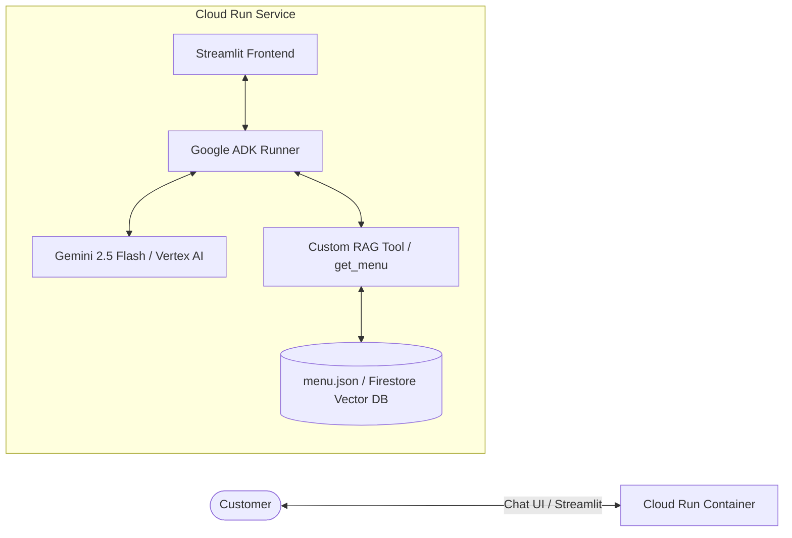

# ☕ Pattern 1: Customer-Facing RAG AI Agent

> **Core Focus:** Grounded Retrieval-Augmented Generation (RAG), Hallucination Prevention, Allergen Safety, and Serverless Streamlit Deployment on Google Cloud Run.

---

## 🏗️ Architecture



## 🚀 Key Capabilities
1. **Zero Hallucination Guardrails:** Agent strictly references verified menu items and prices.
2. **Allergen & Dietary Intelligence:** Evaluates dietary restrictions (dairy-free, gluten-free, vegan) before making suggestions.
3. **Serverless Scalability:** Deployed to Cloud Run with automatic scale-to-zero.

## 💻 Deployment Command
```bash
gcloud run deploy coffee-barista \
  --source . \
  --region us-central1 \
  --allow-unauthenticated \
  --service-account "barista-agent-sa@${PROJECT_ID}.iam.gserviceaccount.com" \
  --set-env-vars GOOGLE_GENAI_USE_VERTEXAI=1,GOOGLE_CLOUD_PROJECT=${PROJECT_ID},GOOGLE_CLOUD_LOCATION=global
```
