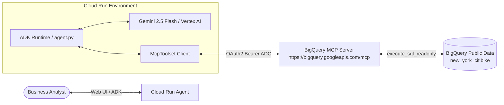

# 📊 Pattern 2: Enterprise SQL Reasoning Agent with BigQuery MCP

> **Core Focus:** Model Context Protocol (MCP) in Production, Multi-Table Data Reasoning, Read-Only SQL Safety, and Enterprise BigQuery Integration.

---

## 🏗️ Architecture



## 🚀 Key Capabilities
1. **Model Context Protocol (MCP) Integration:** Standardized AI protocol integration connecting LLM directly to managed BigQuery data endpoints.
2. **Autonomous Data Investigation:** Schema discovery, column type validation, and dynamic query synthesis without hardcoded prompts.
3. **Read-Only Enterprise Security:** Tool filter restricted to `execute_sql_readonly` ensuring zero database modification risk.

## 💻 Local Testing & Cloud Run Deployment
```bash
# Local Dev Server
adk web --allow_origins="*" --port 8080 .

# Deploy to Cloud Run with ADK Web UI
adk deploy cloud_run \
  --with_ui \
  --project $GOOGLE_CLOUD_PROJECT \
  --region $GOOGLE_CLOUD_REGION \
  --service_name bq-data-agent \
  --app_name data_agent \
  data_agent \
  -- \
  --allow-unauthenticated \
  --set-env-vars GOOGLE_GENAI_USE_VERTEXAI=1,GOOGLE_CLOUD_PROJECT=$GOOGLE_CLOUD_PROJECT,GOOGLE_CLOUD_LOCATION=global
```
