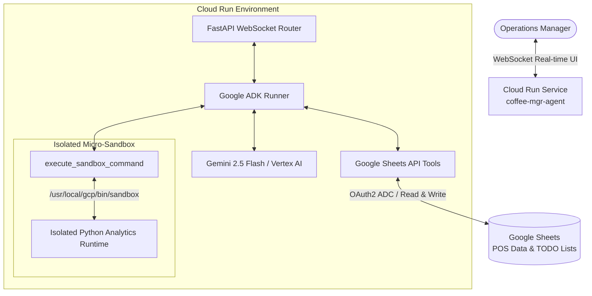

# ⚙️ Pattern 3: Autonomous Operations Agent with Cloud Run Sandboxes

> **Core Focus:** Cloud Run Micro-Sandboxes (`--sandbox-launcher`), Dynamic Python Code Execution, Human-in-the-Loop (HITL) Governance, and Google Sheets API v4 Integration.

---

## 🏗️ Architecture



## 🚀 Key Capabilities
1. **Cloud Run Native Micro-Sandboxing:** Dynamic execution of LLM-generated code in a pre-GA isolated sandbox runtime (`/usr/local/gcp/bin/sandbox`).
2. **Human-in-the-Loop Governance:** Strict behavioral directives preventing external state mutation without explicit user confirmation.
3. **Real-time Bidirectional UI:** WebSockets communication layer with client-side markdown and tabular data rendering.

## 💻 Deployment Command
```bash
gcloud beta run deploy coffee-mgr-agent \
    --source=. \
    --region=us-central1 \
    --sandbox-launcher \
    --max-instances=1 \
    --session-affinity \
    --allow-unauthenticated \
    --no-cpu-throttling \
    --set-env-vars GOOGLE_GENAI_USE_VERTEXAI=1,GOOGLE_CLOUD_PROJECT=$GOOGLE_CLOUD_PROJECT,GOOGLE_CLOUD_LOCATION=global,SPREADSHEET_ID=$SPREADSHEET_ID \
    --service-account $SERVICE_ACCOUNT_ADDRESS
```
