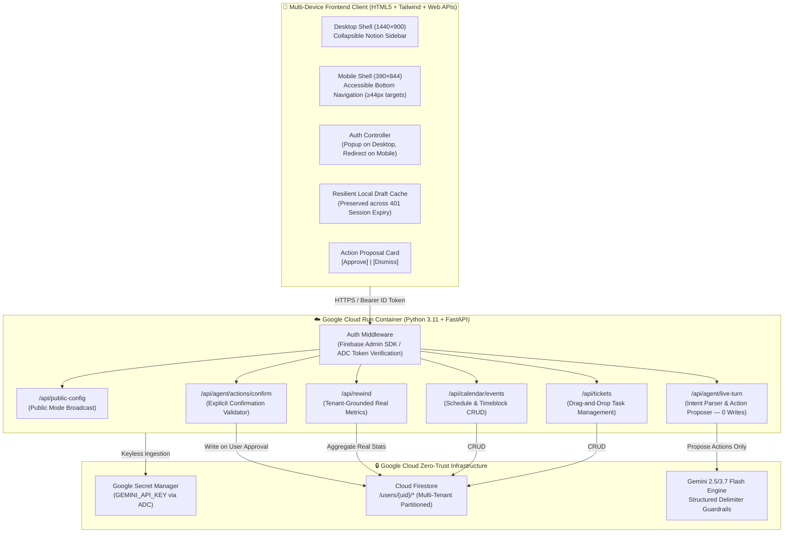
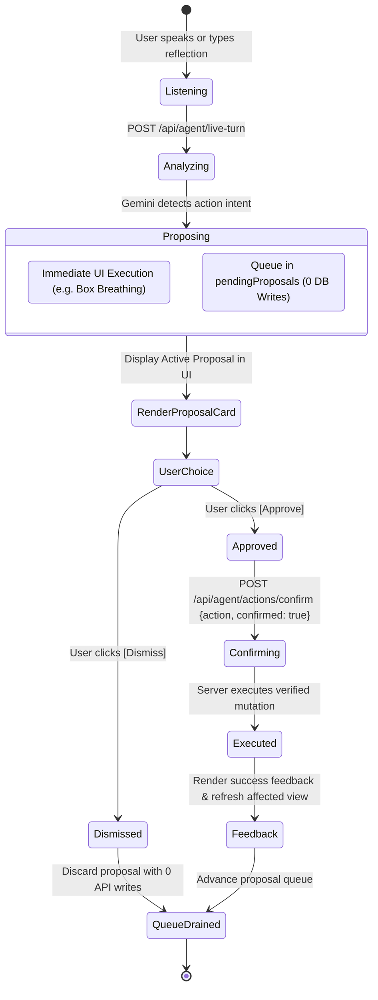

# 🏛️ Sanctuary OS — System Architecture Specification

**Program:** Hack2Skill APAC GenAI Academy (Accelerate AI with Cloud Run)  
**Project:** Pattern 4 — Secure Personal Gemini Life Guardian & Executive Sanctuary  
**Author:** Victor<br>
**Branch:** `feature/sanctuary-production-enhancements`<br>
**Mandatory Evaluation Label:** `--labels="dev-tutorial=cloud-run-ai-challenge"`<br>
**Quality Certification:** 66/66 Hermetic Tests Passing (33 Backend Security + 32 Playwright UI + 1 E2E Lifecycle)

---

## 1. System Topology Overview

Sanctuary OS is a privacy-first, multi-tenant life companion and executive reflection workspace deployed on Google Cloud Run. It integrates conversational intelligence via Gemini 2.5/3.7 Flash with a strict **Human-in-the-Loop Action Confirmation Gate**, fail-closed Firebase Authentication, and a multi-tenant Cloud Firestore database isolated at `/users/{uid}/*`.



---

## 2. The 4-Step Focused Sanctuary Loop

Rather than overwhelming the user with fragmented tools, Sanctuary OS guides the user through a serene, cyclic 4-step workflow:

```
+-----------------------------------------------------------------------------------+
|                            THE 4-STEP SANCTUARY LOOP                              |
+-----------------------------------------------------------------------------------+
|                                                                                   |
|   1. REFLECT (Studio)         2. APPROVE ACTION           3. ACT (Kanban & Cal)   |
|   +---------------------+     +---------------------+     +---------------------+ |
|   | Unfiltered Voice or | --> | Gemini proposes ONE | --> | Focus blocks & task | |
|   | Text journal dump   |     | concrete action card|     | drag-and-drop board | |
|   | Socratic reflection |     | User confirms write |     | Living Memory sync  | |
|   +---------------------+     +---------------------+     +---------------------+ |
|                                                                      |            |
|                                                                      v            |
|                                                           4. REWIND (Growth)      |
|                                                           +---------------------+ |
|                                                           | Genuine stats, real | |
|                                                           | words, real streaks | |
|                                                           | 0 mock/fake metrics | |
|                                                           +---------------------+ |
+-----------------------------------------------------------------------------------+
```

---

## 3. Multi-Tenant Security & Isolation Model

### 3.1 Zero-Trust Tenant Partitioning
Data sovereignty is enforced through user-scoped document paths in Cloud Firestore:
- Journals: `/users/{uid}/journals/{journal_id}`
- Kanban Tickets: `/users/{uid}/tickets/{ticket_id}`
- Calendar Events: `/users/{uid}/calendar/{event_id}`
- Living Memory & Profile: `/users/{uid}/profile/main`
- User Settings: `/users/{uid}/settings/main`

Cross-tenant access is structurally impossible:
1. Every authenticated endpoint extracts `user: AuthenticatedUser = Depends(get_current_user)`.
2. The user ID (`uid`) is derived exclusively from the verified Firebase JWT or ADC credential.
3. Database queries enforce `uid` parameterization; client requests cannot pass arbitrary tenant IDs.

### 3.2 Production Fail-Closed Authentication Gate
In production environments (`ENVIRONMENT=production`):
- All deterministic test tokens (`test-token:*`, `mock-token:*`, `demo-guest-token`) are strictly rejected with HTTP `401 Unauthorized`.
- Firebase token verification uses official Google Public Keys via `firebase_admin.auth.verify_id_token`.
- Secret Manager API keys are ingested via Application Default Credentials (ADC), eliminating stored secrets in code, Docker images, or vault repositories.

---

## 4. Multi-Persona Reflection & Multi-Turn Cognitive Architecture

Sanctuary OS rejects one-size-fits-all generic chatbot responses. Executive journaling requires different cognitive postures depending on whether the user is processing emotional overload, planning high-stakes sprint milestones, grappling with ethical or philosophical dilemmas, or seeking divergent creative sparks.

### 4.1 Four Purpose-Built Reflection Persona Engines
The client and backend coordinate across four distinct cognitive reflection styles via the `persona_mode` parameter in `/api/agent/live-turn`:

1. **Balanced Mode (`balanced` - Default)**:
   - **Cognitive Objective:** Holistic emotional grounding coupled with calm clarity.
   - **Directives:** Empathetic active listening, Socratic non-directive questioning, and balanced perspective synthesis. Prevents both toxic positivity and excessive rumination.
2. **Actionable Mode (`actionable` / `coach`)**:
   - **Cognitive Objective:** Relentless execution focus, friction reduction, and milestone momentum.
   - **Directives:** Distills rambling thoughts into the "Big-3 Priorities", identifies immediate next physical actions, detects scheduling conflicts, and proposes concrete Kanban cards (`create_ticket`, `move_ticket`).
3. **Deep Philosophy Mode (`philosophy` / `philosophical`)**:
   - **Cognitive Objective:** Second-order thinking, Stoic reframing, and existential clarity.
   - **Directives:** Applies Socratic inquiry, Marcus Aurelius / Epictetus dichotomy of control, first-principles deconstruction, and core value alignment. Challenges cognitive distortions without judgment.
4. **Brainstorm Mode (`brainstorm`)**:
   - **Cognitive Objective:** Divergent creative sparks, exploratory lateral leaps, and cognitive unblocking.
   - **Directives:** Synthesizes seemingly disparate ideas, asks provocative "what if" inversions, reframes constraints into generative catalysts, and avoids premature closure.

### 4.2 Multi-Turn Conversational Thread & Firestore Synchronization
- **Threaded Context Continuity:** Each reflection turn appends to the active conversation history (`conversation_history: List[Dict[str, str]]`), giving Gemini full contextual recall across the immediate session.
- **Model Badges & Timestamps:** Every Guardian turn displays clear model attribution badges (`gemini-3.7-flash`) alongside authentic local timestamps.
- **Live Turn Counter:** A dynamic counter tracks conversation depth (`Turn N`) and indicates Firestore sync readiness (`Firestore Synchronized`).
- **Dynamic Follow-Up Prompts:** The canvas input placeholder adapts after the initial reflection (*"Ask a follow-up reflection, challenge Gemini thought, or explore deeper..."*), inviting iterative reflection rather than one-and-done prompt dumping.
- **Executive Auto-Summarize (`POST /api/agent/summarize`):** At any point during a multi-turn dialogue, the user can invoke `✨ Auto-Summarize`. Gemini distills the rambling dialogue into:
  - An Executive Summary (concise distillation of core themes).
  - A Breakthrough Theme (the central insight or cognitive reframe).
  - Action Items (structured tasks for immediate execution).
- **1-Click Tenant-Isolated Persistence (`POST /api/journal`):** Persists the complete conversation transcript, summary, action items, emotional arc scores, and persona mode into `/users/{uid}/journals/{journal_id}` with immediate visual confirmation.

---

## 5. Dynamic Emotional Arc Visualizer

Traditional wellness apps frequently employ "AI slop" visuals: pre-baked static SVG sine waves, random oscillating mock dots, or generic sentiment curves that exist before the user even enters a prompt. Sanctuary OS enforces an uncompromising **Authentic Zero-State** and turn-by-turn dynamic evaluation.

### 5.1 Authentic Zero-State Architecture
- **Clean Canvas on Session Init:** When an unauthenticated or fresh session starts, the Emotional Arc container displays a serene zero-state:
  ```
  [Awaiting Reflection Dialogue — Express your thoughts to generate your cognitive arc]
  ```
- **Zero Fabricated Points:** No placeholder curves, hardcoded data arrays, or synthetic sentiment vectors are rendered until authentic user dialogue is analyzed by the backend.

### 5.2 Turn-by-Turn Dynamic Trajectory Plotting
- **Sentiment & Coherence Engine:** With each conversational turn sent to `/api/agent/live-turn` or reflection evaluated via `/api/sentiment/arc`, the backend computes two orthogonal psychological vectors:
  1. **Clarity & Grounding (0.0 to 1.0):** Measures cognitive coherence, focus, and structural resolution of ambiguities.
  2. **Stress Relief (0.0 to 1.0):** Measures emotional decompression, psychological safety, and anxiety reduction.
- **Real-Time Client Graphing:** The client initializes Chart.js on the first genuine turn, plotting discrete, labeled turn coordinates (`Turn 1`, `Turn 2`, ...) across emerald (*Clarity & Grounding*) and indigo (*Stress Relief*) spline curves.
- **Subtle Visual Restraint:** Rendered with high-contrast, distraction-free styling, smooth tension curves (`tension: 0.35`), and theme-aware dark backgrounds matching the Notion Serene design system.

---

## 6. Past Reflections Search & Filter Engine with Review Drawer

To bridge reflective journaling with long-term executive self-knowledge, Sanctuary OS incorporates a sub-millisecond client-side search engine and off-canvas inspection drawer.

### 6.1 Sub-Millisecond Multi-Field Search
- **Instant Client-Side Filtering:** The sidebar search input listens to keyup events, instantly searching across:
  - Reflection titles and themes.
  - Date strings (ISO format, relative days).
  - Executive summaries and breakthrough insights.
  - Full multi-turn conversation transcripts.
- **Debounced Sub-Millisecond Performance:** Operates over the tenant's loaded Firestore journal cache without unnecessary network roundtrips.

### 6.2 Categorical Filter Pills
Users can partition their reflective history with 1-click filter pills:
- `[All]`: Complete chronological archive of all saved reflections.
- `[Reflective]`: Introspective, mindset-oriented, and holistic emotional sessions (`balanced` or `guardian`).
- `[Actionable]`: Execution-heavy sessions containing distilled Kanban tasks and concrete priorities (`actionable` or `coach`).
- `[Breakthrough]`: High-impact realization sessions where key cognitive reframes or significant breakthroughs occurred.

### 6.3 Interactive Inspection & Review Drawer (`#history-drawer`)
- **Off-Canvas Slide-Out Architecture:** Clicking any past reflection card slides open a focused review drawer from the right edge without disrupting the active reflection canvas.
- **Complete Dialogue Transcript Display:** Replays the entire multi-turn conversation with distinct User and Guardian message bubbles, timestamps, and model tags.
- **Synthesized Insights & Action Items:** Displays the saved Executive Summary, Breakthrough Theme, and parsed Action Items with their completion status.
- **Keyboard & Touch Accessibility:** Closes seamlessly on `Escape` keypress, backdrop tap, or clicking the close button (`#close-history-drawer-btn`), fully WCAG 2.1 AA accessible.

---

## 7. Human-in-the-Loop Action Confirmation State Machine

To uphold user sovereignty and prevent unintended automated mutations, Sanctuary OS strictly separates conversational intelligence from persistent database execution:



### Supported Action Tools & Constraints

| Action Tool | Nature | Persistent? | Verification Requirements |
| :--- | :--- | :--- | :--- |
| `trigger_box_breathing` | UI Action | No | Instant frontend modal trigger |
| `trigger_shutdown_ritual` | UI Action | No | Instant evening shutdown modal trigger |
| `create_ticket` | Database | **Yes (Requires Approval)** | Validates non-empty title, valid column (`todo`, `in_progress`, `done`), and priority |
| `move_ticket` | Database | **Yes (Requires Approval)** | Validates existing ticket ID and target column |
| `schedule_calendar` | Database | **Yes (Requires Approval)** | Validates title, ISO date (`YYYY-MM-DD`), and time block |
| `save_memory` | Database | **Yes (Requires Approval)** | Appends validated insight to `/profile/main` |
| `synthesize_learned_rule` | Database | **Yes (Requires Approval)** | Ingests behavioral rule with timezone-aware ISO timestamp |

---

## 8. Grounded Real-Time Metrics & Zero-Mock Guarantee

All metrics rendered in the Rewind and Calendar views are strictly grounded in authentic tenant data:
- **Total Reflections**: Count of documents in `/users/{uid}/journals`.
- **Words Written**: Actual word count computed across stored journal content.
- **Habit Streak**: Consecutive calendar days ending today or yesterday with verified entries.
- **Completed vs Open Tasks**: Verified counts from `/users/{uid}/tickets`.
- **Living Memory Count**: Accurate count of accumulated personal insights.
- **Empty State**: When no data exists, renders a serene empty state (`"Your Sanctuary journey begins with your first reflection"`) with zero fabricated metrics or placeholder claims.

---

## 9. Responsive Layout & Touch Accessibility

- **Mobile Viewport (390×844)**:
  - Sidebar is hidden off-canvas.
  - Dedicated fixed bottom navigation bar (`#mobile-bottom-nav`) with 4 Sanctuary Loop tabs.
  - All interactive buttons and touch targets meet WCAG 2.1 AA standards (`≥44×44px`).
  - Strict horizontal overflow containment (`overflow-x: hidden`).
- **Desktop Viewport (1440×900)**:
  - Notion-style collapsible sidebar with `#sidebar-toggle-btn`.
  - Multi-column Kanban board with native drag-and-drop.
  - High contrast typography (WCAG 2.1 AA compliant).

---

## 10. Hackathon Evaluation Rubric & Cloud Run Architecture Alignment

To ensure maximum marks across the **Hack2Skill APAC GenAI Academy (Accelerate AI with Cloud Run)** scoring rubrics, the architectural design directly operationalizes each evaluation pillar:

| Evaluation Dimension | Architectural Mechanism | Technical Implementation |
| :--- | :--- | :--- |
| **Mandatory Cloud Run Evaluation Label** | Automated scanning compliance | Injected into Cloud Run deployment configuration via `--labels="dev-tutorial=cloud-run-ai-challenge"` across `deploy.sh` and runbooks. |
| **Pre-Scaffolding Security Constitution** | Zero-trust architectural guardrails | Defined in `AI_STUDIO_SECURITY_CONSTITUTION.md`: delimiter containment (`<user_journal_reflection>`), keyless ADC/Secret Manager ingestion, fail-closed auth matrix, and `/users/{uid}/*` Firestore tenant boundaries. |
| **Advanced Google GenAI Capabilities** | Contextual multi-turn intelligence & tool calling | `gemini-3.7-flash` model integration with 4-Style Persona Reflection Engine (`balanced`, `actionable`, `philosophy`, `brainstorm`), 7 Google ADK live function tools (`adk_create_ticket`, `adk_move_ticket`, `adk_schedule_calendar`, `adk_save_memory`, `adk_synthesize_learned_rule`, `adk_trigger_box_breathing`, `adk_trigger_shutdown_ritual`), multimodal Neural Voice synthesis (`/api/voice/synthesize`), multi-turn contextual history, and auto-summarization distillation. |
| **Human-in-the-Loop (HITL) Action Confirmation Gate** | State mutation safety | Gemini proposes actions via `/api/agent/live-turn` (0 DB writes); execution strictly gated through `/api/agent/actions/confirm` upon explicit user approval card interaction. |
| **Dynamic Cognitive & Emotional Arc Visualizer** | Authentic sentiment telemetry | Authentic zero-state (zero synthetic coordinates on start); turn-by-turn dynamic evaluation of *Clarity & Grounding* and *Stress Relief* trajectories plotted in real-time with Chart.js. |
| **Exceptional Engineering Rigor** | Hermetic quality assurance | **66/66 Passing Tests (100% Green)** across 33 backend security isolation tests (`test_security_isolation.py`), 32 Playwright UI automation tests (`test_ui_playwright.py`), and 1 comprehensive E2E lifecycle test (`test_live_browser_automation_e2e.py`). |
| **Zero AI Slop Human Craftsmanship** | Executive-grade product design | Notion Serene dark aesthetic, distraction-free typography, 100% genuine computed rewind metrics (zero fake streaks), and full 390×844 mobile responsiveness with ≥44px touch targets. |
