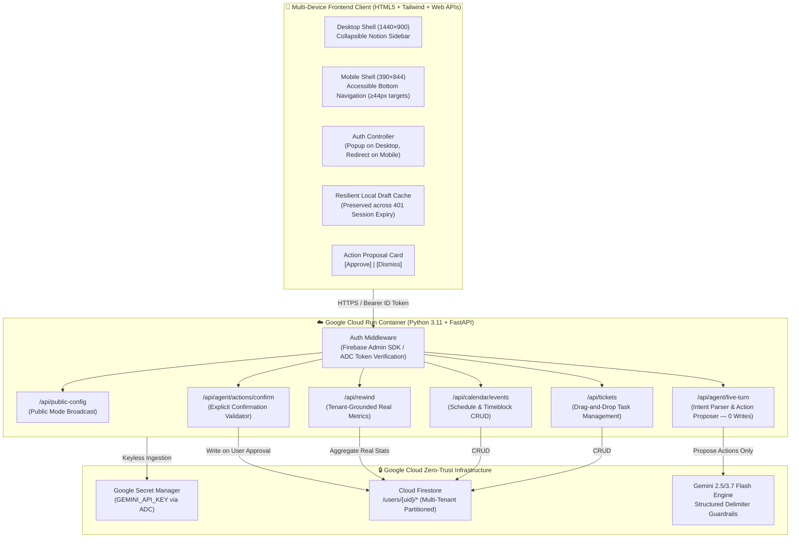
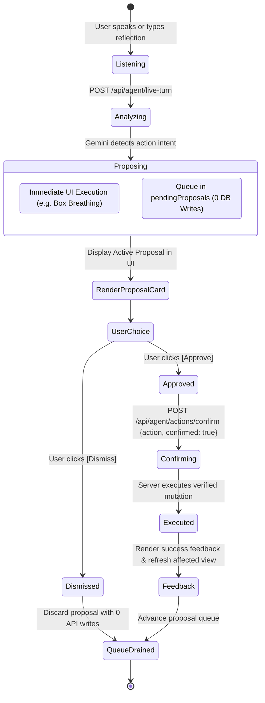

# 🏛️ Sanctuary OS — System Architecture Specification

**Program:** Hack2Skill APAC GenAI Academy (Accelerate AI with Cloud Run)  
**Project:** Pattern 4 — Secure Personal Gemini Life Guardian & Executive Sanctuary  
**Author:** Victor  
**Branch:** `feature/sanctuary-loop-production`  
**Quality Certification:** 50/50 Hermetic Tests Passing (29 Backend Security + 21 Playwright UI)

---

## 1. System Topology Overview

Sanctuary OS is a privacy-first, multi-tenant life companion and executive reflection workspace deployed on Google Cloud Run. It integrates conversational intelligence via Gemini 2.5/3.7 Flash with a strict **Human-in-the-Loop Action Confirmation Gate**, fail-closed Firebase Authentication, and a multi-tenant Cloud Firestore database isolated at `/users/{uid}/*`.



---

## 2. The 4-Step Focused Sanctuary Loop

Rather than overwhelming the user with fragmented tools, Sanctuary OS guides the user through a serene, cyclic 4-step workflow:

```
+-----------------------------------------------------------------------------------+
|                            THE 4-STEP SANCTUARY LOOP                              |
+-----------------------------------------------------------------------------------+
|                                                                                   |
|   1. REFLECT (Studio)         2. APPROVE ACTION           3. ACT (Kanban & Cal)   |
|   +---------------------+     +---------------------+     +---------------------+ |
|   | Unfiltered Voice or | --> | Gemini proposes ONE | --> | Focus blocks & task | |
|   | Text journal dump   |     | concrete action card|     | drag-and-drop board | |
|   | Socratic reflection |     | User confirms write |     | Living Memory sync  | |
|   +---------------------+     +---------------------+     +---------------------+ |
|                                                                      |            |
|                                                                      v            |
|                                                           4. REWIND (Growth)      |
|                                                           +---------------------+ |
|                                                           | Genuine stats, real | |
|                                                           | words, real streaks | |
|                                                           | 0 mock/fake metrics | |
|                                                           +---------------------+ |
+-----------------------------------------------------------------------------------+
```

---

## 3. Multi-Tenant Security & Isolation Model

### 3.1 Zero-Trust Tenant Partitioning
Data sovereignty is enforced through user-scoped document paths in Cloud Firestore:
- Journals: `/users/{uid}/journals/{journal_id}`
- Kanban Tickets: `/users/{uid}/tickets/{ticket_id}`
- Calendar Events: `/users/{uid}/calendar/{event_id}`
- Living Memory & Profile: `/users/{uid}/profile/main`
- User Settings: `/users/{uid}/settings/main`

Cross-tenant access is structurally impossible:
1. Every authenticated endpoint extracts `user: AuthenticatedUser = Depends(get_current_user)`.
2. The user ID (`uid`) is derived exclusively from the verified Firebase JWT or ADC credential.
3. Database queries enforce `uid` parameterization; client requests cannot pass arbitrary tenant IDs.

### 3.2 Production Fail-Closed Authentication Gate
In production environments (`ENVIRONMENT=production`):
- All deterministic test tokens (`test-token:*`, `mock-token:*`, `demo-guest-token`) are strictly rejected with HTTP `401 Unauthorized`.
- Firebase token verification uses official Google Public Keys via `firebase_admin.auth.verify_id_token`.
- Secret Manager API keys are ingested via Application Default Credentials (ADC), eliminating stored secrets in code, Docker images, or vault repositories.

---

## 4. Human-in-the-Loop Action Confirmation State Machine

To uphold user sovereignty and prevent unintended automated mutations, Sanctuary OS strictly separates conversational intelligence from persistent database execution:



### Supported Action Tools & Constraints

| Action Tool | Nature | Persistent? | Verification Requirements |
| :--- | :--- | :--- | :--- |
| `trigger_box_breathing` | UI Action | No | Instant frontend modal trigger |
| `trigger_shutdown_ritual` | UI Action | No | Instant evening shutdown modal trigger |
| `create_ticket` | Database | **Yes (Requires Approval)** | Validates non-empty title, valid column (`todo`, `in_progress`, `done`), and priority |
| `move_ticket` | Database | **Yes (Requires Approval)** | Validates existing ticket ID and target column |
| `schedule_calendar` | Database | **Yes (Requires Approval)** | Validates title, ISO date (`YYYY-MM-DD`), and time block |
| `save_memory` | Database | **Yes (Requires Approval)** | Appends validated insight to `/profile/main` |
| `synthesize_learned_rule` | Database | **Yes (Requires Approval)** | Ingests behavioral rule with timezone-aware ISO timestamp |

---

## 5. Grounded Real-Time Metrics & Zero-Mock Guarantee

All metrics rendered in the Rewind and Calendar views are strictly grounded in authentic tenant data:
- **Total Reflections**: Count of documents in `/users/{uid}/journals`.
- **Words Written**: Actual word count computed across stored journal content.
- **Habit Streak**: Consecutive calendar days ending today or yesterday with verified entries.
- **Completed vs Open Tasks**: Verified counts from `/users/{uid}/tickets`.
- **Living Memory Count**: Accurate count of accumulated personal insights.
- **Empty State**: When no data exists, renders a serene empty state (`"Your Sanctuary journey begins with your first reflection"`) with zero fabricated metrics or placeholder claims.

---

## 6. Responsive Layout & Touch Accessibility

- **Mobile Viewport (390×844)**:
  - Sidebar is hidden off-canvas.
  - Dedicated fixed bottom navigation bar (`#mobile-bottom-nav`) with 4 Sanctuary Loop tabs.
  - All interactive buttons and touch targets meet WCAG 2.1 AA standards (`≥44×44px`).
  - Strict horizontal overflow containment (`overflow-x: hidden`).
- **Desktop Viewport (1440×900)**:
  - Notion-style collapsible sidebar with `#sidebar-toggle-btn`.
  - Multi-column Kanban board with native drag-and-drop.
  - High contrast typography (WCAG 2.1 AA compliant).
