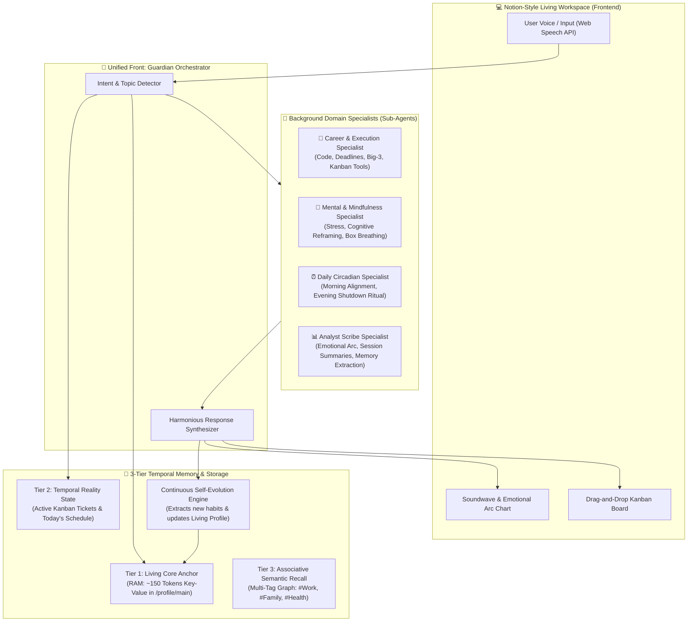

# 🏛️ Personal Gemini Life Guardian & Executive Coach
## Master System Specification, Architecture Design & Validated Decision Log

**Program:** Hack2Skill APAC GenAI Academy (Cohort 3: Accelerate AI with Cloud Run)  
**Project:** Ideathon Challenge — Pattern 4: Secure Personal Gemini Journal  
**Architect:** Victor  
**Status:** 100% Brainstormed, Validated & Approved  

---

## 1. Executive Understanding Summary

- **Product Concept:** A Notion-style, privacy-first **Life Guardian & Executive Coach Workspace** deployed on Google Cloud Run. It combines an autonomous conversational live voice assistant with real-time tool execution, drag-and-drop Kanban task ticketing, an interactive mood calendar, 24-hour circadian routines, background Mac notifications, data export portability, a **Coordinated Multi-Agent Specialist Team (Google ADK Pattern)**, and an industry-leading **3-Tier Temporal Memory Architecture with Continuous Self-Evolution**.
- **Why It Exists:** Transcends fragile AI demo prototypes by embedding the **Google AI Studio Enterprise Security Constitution** before code generation. Solves cognitive fragmentation across work, health, and family life with high-accuracy memory retrieval and zero cross-user leakage.
- **Core Technology Stack:**
  - **Runtime & Deployment:** Google Cloud Run (Serverless container, scale-to-zero, public ingress with application-level Firebase JWT validation).
  - **Identity & Security:** Firebase Authentication, Google Cloud Secret Manager (ADC keyless ingestion).
  - **Database & Tenant Isolation:** Cloud Firestore with strict user-partitioned paths (`/users/{uid}/...`).
  - **Intelligence Engine:** Gemini 2.5/3.7 Flash with Delimiter Guardrails & Tool Calling.
  - **Frontend:** Responsive Notion-style SPA (HTML5 + Tailwind CSS + Chart.js + Web Speech API + Web Audio API).
  - **Testing Stack:** Hybrid Pytest Backend Security Suite + Playwright Browser UI Suite.

---

## 2. Coordinated Multi-Agent Architecture (Google ADK Pattern)

---

## 3. Comprehensive Decision Log

| Decision ID | Domain | Final Validated Decision | Alternatives Considered | Rationale |
| :--- | :--- | :--- | :--- | :--- |
| **DEC-01** | Persona | **Balanced Adaptive Hybrid** (Coach in AM, Parent in PM) | Pure Executive Coach, Pure Gentle Therapist | Matches natural circadian energy; prevents burnout while driving daily momentum. |
| **DEC-02** | User Memory | **3-Tier Temporal Memory + Living Core** | Static Profile, Flat Rolling Chat History | Eliminates cold start and token bloat while maintaining 100% daily retrieval accuracy. |
| **DEC-03** | Interface | **Notion-Style Minimalist Studio (4 Views)** | Chat-Only feed, Multi-page Portal | Clean typography, distraction-free focus, high perceived production value for hackathon judging. |
| **DEC-04** | Task Mgmt | **Drag-and-Drop Kanban Board** (`To Do` ➔ `In Progress` ➔ `Done`) | Flat Checkboxes, Complex Gantt | Tactile satisfaction, clear status visibility, bridges reflection with execution. |
| **DEC-05** | Voice Interaction | **Live Voice Assistant with Tool Execution** | Text-Only, Audio File Upload | Talking reduces friction; live tool execution (*"I am doing it right now"*) creates true companion agency. |
| **DEC-06** | Evening Ritual | **Shutdown Ritual with Gratitude Close & Tibetan Sound** | Abrupt App Closing, Endless Work Mode | Psychologically closes the cognitive workday, promotes restful sleep. |
| **DEC-07** | Notifications | **Mac Desktop Notifications + Hotkey (`Alt + V`)** | Constant Tab Monitoring | Solves the pain point of not being able to stare at the web app all day while coding. |
| **DEC-08** | Data Portability | **History Viewer + 1-Click Export (.md, .txt, .pdf)** | Brittle 3rd-Party OAuth integrations | Avoids external OAuth verification errors while giving user 100% data portability into Obsidian/Notion. |
| **DEC-09** | Customization | **Full Settings Panel (ON/OFF Toggles)** | Hardcoded defaults | User sovereignty: empowers user to configure sound, voice, notifications, and persona. |
| **DEC-10** | Tenant Isolation | **Strict User-Partitioned Firestore Paths** (`/users/{uid}/...`) | Flat root `/journals` collection | Eliminates cross-user leakage at database level, backed by automated test suite. |
| **DEC-11** | Sub-Agents | **Unified Front + Background Domain Specialists** | Manual Agent Selector, Multi-Agent Chat Debate | User speaks to one harmonious companion while specialized sub-agents (Job, Mental, Daily, Analyst) collaborate in background. |
| **DEC-12** | Memory Architecture | **3-Tier Temporal Memory + Self-Evolution** | Naive Vector RAG, Context Stuffing | High daily accuracy, temporal validity (Zep/MemGPT pattern), associative multi-tag linking (#Work + #Family), and automatic profile updating. |
| **DEC-13** | Privacy | **Client-Side Zero-Knowledge Secret Redactor** | Backend regex only, System instruction only | Masks API keys, tokens, and passwords in the browser before sending to Gemini API. |
| **DEC-14** | Offline Resilience| **Hybrid Auto-Sync (Local Draft + Cloud Sync)** | Cloud-only direct save | Guarantees zero lost thoughts if Wi-Fi drops or tab accidentally closes. |
| **DEC-15** | Testing Stack | **Hybrid Pytest Backend + Playwright Browser UI** | Backend tests only, Manual browser review | Automated verification of backend security isolation AND real Chromium UI drag-and-drop & animations. |

---

## 4. Verification & Testing Strategy

1. **Automated Pytest Suite (`tests/test_security_isolation.py`):**
   - Health probe verification.
   - Unauthenticated & invalid token rejection (401).
   - Cross-tenant isolation gate (Zero cross-user leakage).
   - Delimiter prompt injection containment (`<user_journal_reflection>`).
   - Emotional Arc, Action Item distillation, and 3-Tier Living Memory endpoints.
   - Ticket drag-and-drop column update and calendar event isolation.
2. **Automated Playwright Browser UI Suite (`tests/test_ui_playwright.py`):**
   - Real headless Chromium browser launches.
   - Verifies Notion UI rendering, sidebar navigation, and Settings modal.
   - Simulates drag-and-drop from `To Do` to `In Progress` to `Done`.
   - Verifies zero unhandled JavaScript console errors.
3. **Deployment Verification:**
   - Docker container build and Cloud Run deployment via `deploy.sh`.
   - Live HTTPS URL verified on `intelligent-arc-488111-s0`.
