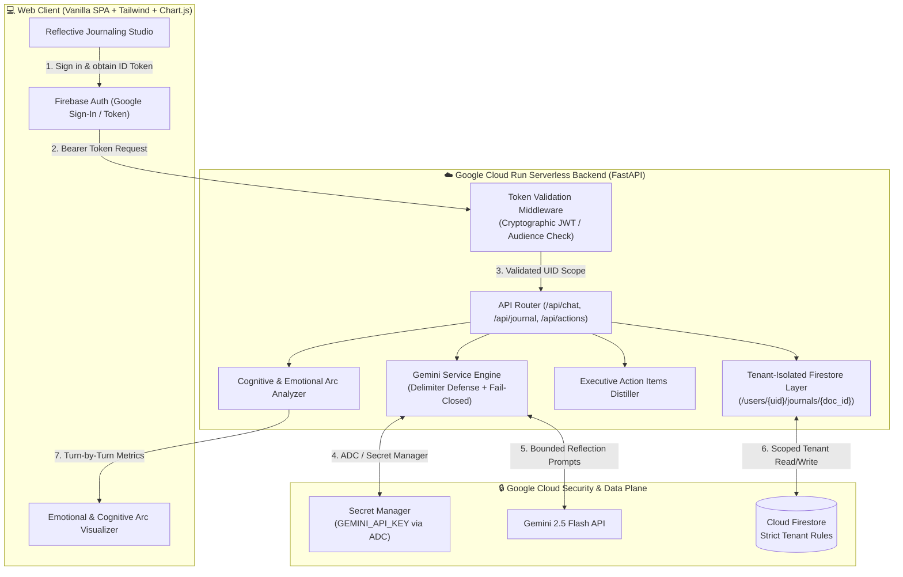

# 🛡️ Pattern 4: Secure Personal Gemini Journal
### Production AI Journaling Platform with Zero-Trust Multi-Tenant Isolation on Google Cloud Run

[](https://cloud.google.com/run)
[](https://firebase.google.com/docs/auth)
[](https://firebase.google.com/docs/firestore)
[](https://cloud.google.com/secret-manager)
[](https://ai.google.dev)
[](LICENSE)

> Built for the **Hack2Skill APAC GenAI Academy (Cohort 3: Accelerate AI with Cloud Run)** Ideathon Challenge.  
> Directly solves the industry-wide failure mode: *"Most AI-generated apps look great in a demo and fall apart in production — hardcoded keys, no auth boundaries, shared databases with zero isolation."*

---

## 🏛️ System Architecture



---

## 🛡️ The 4 Core Security Pillars

| Security Pillar | Production Implementation | Defense Mechanism |
| :--- | :--- | :--- |
| **1. User Authentication** | Firebase Authentication (Google Sign-In / Email) | Cryptographic JWT verification on backend via Google Identity Toolkit; validates issuer, audience, and expiry. |
| **2. Multi-turn AI Interaction** | Gemini 3.7 Flash with Delimiter Guardrails | User reflections are encapsulated within `<user_journal_reflection>` delimiters to prevent prompt injection and instruction overrides. |
| **3. Isolated Data Storage** | Cloud Firestore (`/users/{uid}/journals/{doc_id}`) | Strict user-scoped document hierarchy. User A cannot view, modify, or delete User B's entries (Zero Cross-User Leakage). Enforced via backend logic and `firestore.rules`. |
| **4. Secure Key Management** | Google Cloud Secret Manager + ADC | Zero hardcoded keys. API keys are loaded dynamically at runtime via Application Default Credentials (ADC). |

---

## ✨ The 4-Step Focused Sanctuary Loop

Rather than overwhelming the user with fragmented tools, Sanctuary OS guides the user through an intentional 4-step loop:

1. **Reflect (Studio):** Express unfiltered thoughts via live speech or text. The Guardian listens, reflects Socratically, and helps calm cognitive chatter.
2. **Approve One Action (Human-in-the-Loop Gate):** Gemini proposes exactly ONE concrete action card (e.g., create a task, move a card, schedule a focus block). The model NEVER auto-writes to the database; the user must explicitly click **Approve** or **Dismiss**.
3. **Act (Kanban & Calendar):** Move approved tasks across the tactile drag-and-drop board (`To Do` ➔ `In Progress` ➔ `Done & Celebrated`) and manage scheduled focus blocks.
4. **Rewind (Grounded Growth):** Celebrate authentic progress with real reflection counts, real words written, real consecutive streaks, and genuine living memories (0 mock or fabricated metrics).

---

## 🛡️ Core Security Architecture & Governance

- **Zero-Trust Tenant Isolation:** Strict user-partitioned Firestore paths (`/users/{uid}/*`).
- **Fail-Closed Authentication:** Deterministic/mock tokens are strictly rejected in production (`ENVIRONMENT=production`).
- **Delimiter Prompt Injection Defense:** All user input is contained inside `<user_journal_reflection>` boundaries.
- **Client-Side Secret Redaction:** Scrubbing of API keys, tokens, and passwords in the browser before transmission.
- **Zero Hardcoded Secrets:** Application Default Credentials (ADC) load API keys dynamically from Google Secret Manager.

---

## 🏷️ Mandatory Automated Verification Label
Per Hack2Skill & Google Cloud guidelines, this Cloud Run service is deployed with the required label for automated evaluation:
```yaml
labels:
  dev-tutorial: cloud-run-ai-challenge
```

---

## 📸 Deliverable 1: Google AI Studio Security Constitution

As required by the Ideathon Challenge, Google AI Studio was pre-configured with the **Enterprise Security Constitution** before code generation.

See the full directives in [AI_STUDIO_SECURITY_CONSTITUTION.md](./AI_STUDIO_SECURITY_CONSTITUTION.md).


---

## 🧪 Security & Multi-Tenant Automated Test Suite (50/50 Passing)

Run the complete 50-test suite (29 backend security/isolation tests + 21 browser UI tests):

```bash
cd 04-personal-gemini-journal
python3 -m venv .venv
source .venv/bin/activate
python -m pip install -r requirements.txt
python -m playwright install chromium
ENVIRONMENT=test ALLOW_TEST_AUTH=true USE_MOCK_DB=true GEMINI_API_KEY=placeholder_key python -m pytest tests/test_security_isolation.py tests/test_ui_playwright.py -v
```

### Verified Test Categories:
- **Backend Security & Tenant Isolation (29 tests):** Health checks, unauthenticated/forged token rejection (401), cross-tenant zero-leakage, delimiter prompt injection containment, ticket CRUD isolation, calendar event CRUD & delete isolation, rewind metrics tenant grounding, living memory isolation, fail-closed production auth gate matrix.
- **Playwright Browser End-to-End Suite (21 tests):** Unauthenticated landing state, authenticated app reveal & sign-out, hermetic test auth adapter gate, human-in-the-loop action proposal approval & dismissal flow, genuine rewind metrics display, rewind clean empty state, calendar focus event CRUD & deletion, 401 session expiry draft preservation, mobile 390×844 responsive layout & touch targets (≥44px), desktop 1440×900 collapsible sidebar, drag-and-drop Kanban, and Burmese language localization.

---

## 🚀 Local Quickstart & Development

### 1. Prerequisites
- Python 3.11+
- Google Cloud SDK (`gcloud`) authenticated

### 2. Setup Environment
```bash
cd 04-personal-gemini-journal
pip install -r requirements.txt
```

### 3. Run Locally
```bash
uvicorn main:app --host 0.0.0.0 --port 8080 --reload
```
Open your browser at `http://localhost:8080` to access the journal studio.

---

## ☁️ Google Cloud Run Deployment

Deploy live to Google Cloud Run in one command:

```bash
chmod +x deploy.sh
./deploy.sh
```

Or deploy manually via `gcloud`:
```bash
gcloud run deploy personal-gemini-journal \
    --source . \
    --region us-central1 \
    --allow-unauthenticated \
    --memory 512Mi \
    --cpu 1
```

---

## 📜 License & Acknowledgements
Developed under the **MIT License** as part of the **Google Cloud GenAI Academy APAC Edition**.  
Hashtag: `#AccelerateAIwithCloudRun`
