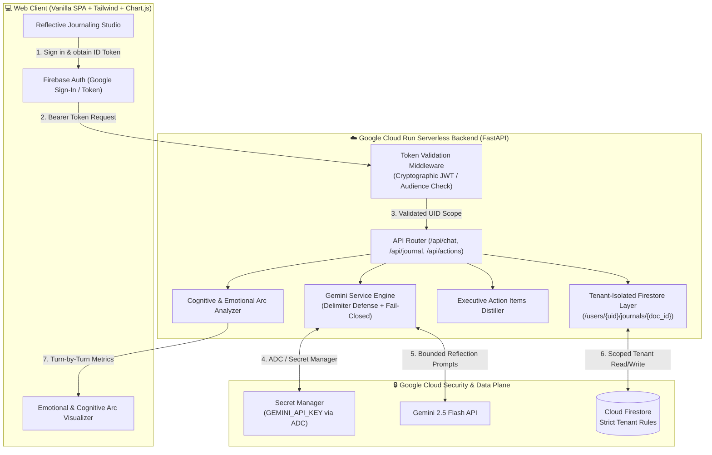

# 🛡️ Pattern 4: Secure Personal Gemini Journal
### Production AI Journaling Platform with Zero-Trust Multi-Tenant Isolation on Google Cloud Run

[](https://cloud.google.com/run)
[](https://firebase.google.com/docs/auth)
[](https://firebase.google.com/docs/firestore)
[](https://cloud.google.com/secret-manager)
[](https://ai.google.dev)
[](LICENSE)

> Built for the **Hack2Skill APAC GenAI Academy (Cohort 3: Accelerate AI with Cloud Run)** Ideathon Challenge.  
> Directly solves the industry-wide failure mode: *"Most AI-generated apps look great in a demo and fall apart in production — hardcoded keys, no auth boundaries, shared databases with zero isolation."*

---

## 🏛️ System Architecture



---

## 🛡️ The 4 Core Security Pillars

| Security Pillar | Production Implementation | Defense Mechanism |
| :--- | :--- | :--- |
| **1. User Authentication** | Firebase Authentication (Google Sign-In / Email) | Cryptographic JWT verification on backend via Google Identity Toolkit; validates issuer, audience, and expiry. |
| **2. Multi-turn AI Interaction** | Gemini 3.7 Flash with Delimiter Guardrails | User reflections are encapsulated within `<user_journal_reflection>` delimiters to prevent prompt injection and instruction overrides. |
| **3. Isolated Data Storage** | Cloud Firestore (`/users/{uid}/journals/{doc_id}`) | Strict user-scoped document hierarchy. User A cannot view, modify, or delete User B's entries (Zero Cross-User Leakage). Enforced via backend logic and `firestore.rules`. |
| **4. Secure Key Management** | Google Cloud Secret Manager + ADC | Zero hardcoded keys. API keys are loaded dynamically at runtime via Application Default Credentials (ADC). |

---

## ✨ Original Feature Enhancements (Phase 3 Innovation)

Beyond the baseline requirements, this application introduces seven unique, high-impact features designed to foster emotional resilience and executive momentum:

### 1. 🤖 Coordinated Multi-Agent Team with Hermes-Inspired Self-Learning
- **Unified Front Guardian:** Natural, empathetic life companion (Google ADK Supervisor pattern) without artificial persona flipping.
- **Hermes Closed-Loop Learning:** Captures user corrections and synthesizes permanent operational rules into Firestore profile (`learned_rules`).
- **Analyst Scribe Agent:** 3-Tier Cerebras-backed memory synthesis and real-time emotional scoring.

### 2. 📋 Interactive Drag-and-Drop Kanban Board
- Native HTML5 draggable task cards (`To Do` ➔ `In Progress` ➔ `Done`) with live Firestore sync.

### 3. 🎙️ Live Voice Assistant with Real-Time Tool Execution
- Spoken conversational feedback with live tool triggers (`create_ticket`, `move_ticket`, `schedule_calendar`, `trigger_box_breathing`, `trigger_shutdown_ritual`, `save_memory`).

### 4. 📈 Emotional & Cognitive Arc Visualizer
- Automatically extracts turn-by-turn **Sentiment Score** (-1.0 to +1.0) and **Energy Level** (0.0 to 1.0) with real-time Chart.js progression.

### 5. 🌙 24-Hour Circadian Routine with Tibetan Chime
- Morning kickstart and evening shutdown ritual with synthetic Tibetan singing bowl sound chime (Web Audio API).

### 6. 🌐 Dual Language Toggle & GDPR Data Sovereignty
- Seamless real-time toggle between English and Burmese (`မြန်မာ`).
- 1-Click "Reset My Sanctuary" data purge with pre-wipe Markdown export prompt.

---

## 🏷️ Mandatory Automated Verification Label
Per Hack2Skill & Google Cloud guidelines, this Cloud Run service is deployed with the required label for automated evaluation:
```yaml
labels:
  dev-tutorial: cloud-run-ai-challenge
```

---

## 📸 Deliverable 1: Google AI Studio Security Constitution

As required by the Ideathon Challenge, Google AI Studio was pre-configured with the **Enterprise Security Constitution** before code generation.

See the full directives in [AI_STUDIO_SECURITY_CONSTITUTION.md](./AI_STUDIO_SECURITY_CONSTITUTION.md).


---

## 🧪 Security & Multi-Tenant Automated Test Suite

Create a fresh environment, install the declared Python dependencies and Chromium, then run the complete 25-test gate (14 security/isolation tests + 11 browser UI tests):

```bash
cd 04-personal-gemini-journal
python3 -m venv .venv
source .venv/bin/activate
python -m pip install -r requirements.txt
python -m playwright install chromium
python -m pytest tests/test_security_isolation.py tests/test_ui_playwright.py -v
```

### Verified Test Cases:
- `test_health_endpoint`: Verifies service health probe.
- `test_unauthenticated_request_rejected`: Confirms unauthenticated requests fail with HTTP 401.
- `test_invalid_token_rejected`: Confirms forged tokens fail with HTTP 401.
- `test_user_profile_identification`: Verifies identity claims extraction.
- `test_cross_tenant_isolation_zero_leakage`: **Critical Gate** — Verifies User A's private entry cannot be viewed, listed, or deleted by User B (returns HTTP 404/403).
- `test_prompt_injection_defense_containment`: Confirms delimiter override attacks are safely contained.
- `test_feature_emotional_arc_endpoint`: Confirms dynamic sentiment & clarity scoring.
- `test_feature_action_items_distillation_endpoint`: Confirms structured task extraction.

---

## 🚀 Local Quickstart & Development

### 1. Prerequisites
- Python 3.11+
- Google Cloud SDK (`gcloud`) authenticated

### 2. Setup Environment
```bash
cd 04-personal-gemini-journal
pip install -r requirements.txt
```

### 3. Run Locally
```bash
uvicorn main:app --host 0.0.0.0 --port 8080 --reload
```
Open your browser at `http://localhost:8080` to access the journal studio.

---

## ☁️ Google Cloud Run Deployment

Deploy live to Google Cloud Run in one command:

```bash
chmod +x deploy.sh
./deploy.sh
```

Or deploy manually via `gcloud`:
```bash
gcloud run deploy personal-gemini-journal \
    --source . \
    --region us-central1 \
    --allow-unauthenticated \
    --memory 512Mi \
    --cpu 1
```

---

## 📜 License & Acknowledgements
Developed under the **MIT License** as part of the **Google Cloud GenAI Academy APAC Edition**.  
Hashtag: `#AccelerateAIwithCloudRun`
