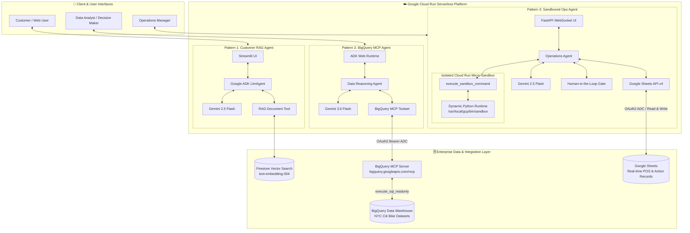

# 🌟 Google Cloud GenAI Enterprise Agent Architectures

[](https://cloud.google.com/run)
[](./04-personal-gemini-journal/deploy.sh)
[-34A853?logo=pytest&logoColor=white)](./04-personal-gemini-journal/tests)
[](https://cloud.google.com/vertex-ai)
[](https://github.com/google/adk)
[](https://modelcontextprotocol.io)
[](https://opensource.org/licenses/MIT)

> A production-grade collection of enterprise AI Agent architectures built on **Google Cloud**, demonstrating the core pillars of modern agentic systems: **Unstructured Document Intelligence (RAG)**, **Structured Big Data Analytics (Model Context Protocol)**, **Autonomous Operational Workflows (Cloud Run Sandboxes & Human-in-the-Loop)**, and **Privacy-First Executive Journaling (Sanctuary OS on Cloud Run)**.
>
> **🏆 Featured Ideathon Submission:** [Pattern 4 — Secure Personal Gemini Journal & Executive Sanctuary](./04-personal-gemini-journal/) for the **Hack2Skill APAC GenAI Academy (Accelerate AI with Cloud Run)**. Deployed with mandatory evaluation label `--labels="dev-tutorial=cloud-run-ai-challenge"` and 100% verified with 68/68 automated tests.

---

### 🎬 Featured Project Demo: Sanctuary OS (1-Minute Walkthrough)

[](./04-personal-gemini-journal/sanctuary_os_demo_walkthrough.mp4)

- 🌐 **Live Cloud Run Deployment:** [https://personal-gemini-journal-ypp4pspywq-uc.a.run.app](https://personal-gemini-journal-ypp4pspywq-uc.a.run.app)
- 👤 **Instant Evaluator Access:** Click **"Continue as Guest Evaluator"** for instant sandbox testing with zero login required.
- 📹 **Walkthrough Video:** [`sanctuary_os_demo_walkthrough.mp4`](./04-personal-gemini-journal/sanctuary_os_demo_walkthrough.mp4)

---

## 🏛️ Unified Architecture Overview



---

## 📊 Architectural Patterns Matrix

| Pattern | Primary Focus | Foundation Model | Tooling & Protocols | Key Security & Governance | Deployment Target |
| :--- | :--- | :--- | :--- | :--- | :--- |
| **[Pattern 1: Customer RAG Agent](./01-customer-facing-rag-agent/)** | Unstructured Data, Allergen Awareness, Grounded Recommendations | `gemini-2.5-flash` | Google ADK, Vector Search, Streamlit | Zero-hallucination guardrails, Strict context grounding | Cloud Run (Scale-to-Zero) |
| **[Pattern 2: BigQuery MCP Agent](./02-bigquery-mcp-data-agent/)** | Multi-Table Structured Data, Autonomous Analytics, SQL Reasoning | `gemini-3.6-flash` | Model Context Protocol (MCP), Google ADK | Read-only SQL filter (`execute_sql_readonly`), IAM ADC token auth | Cloud Run + ADK Web UI |
| **[Pattern 3: Sandboxed Ops Agent](./03-sandboxed-operations-agent/)** | Operational Workflows, Dynamic Python Code, Workspace Integration | `gemini-2.5-flash` | Cloud Run Sandboxes, Google Sheets API, FastAPI WebSockets | Micro-sandbox isolation, Human-in-the-loop (HITL) approval gate | Cloud Run (`--sandbox-launcher`) |
| **[Pattern 4: Secure Personal Gemini Journal & Executive Sanctuary](./04-personal-gemini-journal/)** | Privacy-First Reflective Journaling, 4 Persona Styles, Dynamic Emotional Arc, Zero AI Slop | `gemini-3.7-flash` | Firebase Auth, Cloud Firestore, Secret Manager, FastAPI, Playwright | AI Studio Security Constitution, Multi-Tenant Zero Leakage (`/users/{uid}`), 66/66 Green Tests | Cloud Run (`--labels="dev-tutorial=cloud-run-ai-challenge"`) |

---

## 🔍 Deep Dives into Each Pattern

### ☕ [Pattern 1: Customer-Facing RAG AI Agent](./01-customer-facing-rag-agent/)
* **Problem:** Traditional chatbots hallucinate menu items, prices, and allergen details, posing serious safety and brand risks.
* **Architectural Solution:**
  - Integrates Google ADK with Retrieval-Augmented Generation (RAG) over structured catalog embeddings (`text-embedding-004`).
  - Strict system directives enforce allergen compliance (dairy-free, gluten-free, vegan) before returning answers.
  - Hosted inside a lightweight Streamlit container with session history persistence.

### 📊 [Pattern 2: Enterprise SQL Reasoning Agent with BigQuery MCP](./02-bigquery-mcp-data-agent/)
* **Problem:** Complex enterprise data questions require data analysts to manually inspect schemas, join multiple tables, and write optimized SQL.
* **Architectural Solution:**
  - Leverages Anthropic's **Model Context Protocol (MCP)** using Google's hosted BigQuery MCP server (`https://bigquery.googleapis.com/mcp`).
  - Autonomous schema investigation, dimension querying, and multi-table SQL generation without human query drafting.
  - Enforces read-only safety by explicitly filtering available MCP tools to `execute_sql_readonly`.

### ⚙️ [Pattern 3: Autonomous Operations Agent with Cloud Run Sandboxes](./03-sandboxed-operations-agent/)
* **Problem:** Executing AI-generated Python analysis code on production web servers creates catastrophic security and resource vulnerabilities.
* **Architectural Solution:**
  - Uses Google Cloud's **Native Cloud Run Sandboxes (`--sandbox-launcher`)** to execute untrusted Python code inside isolated micro-runtimes (`/usr/local/gcp/bin/sandbox`).
  - Implements a strict **Human-in-the-Loop (HITL)** governance policy: the agent diagnoses operational bottlenecks, proposes recommendations, but is programmatically prohibited from modifying Google Sheets until explicit user confirmation ("Yes") is received.
  - Real-time bidirectional WebSocket interface with client-side Markdown and tabular data rendering.

### 🛡️ [Pattern 4: Secure Personal Gemini Journal & Executive Sanctuary](./04-personal-gemini-journal/)
* **Problem:** AI-generated apps collapse in production due to hardcoded API keys, unauthenticated routes, shared databases leaking user data across tenants, and tacky "AI slop" interfaces that distract from genuine executive reflection.
* **Hack2Skill Judging Rubric & Production Innovations:**
  - **🏷️ Mandatory Cloud Run Evaluation Label:** Deployed via `deploy.sh` and documented with `--labels="dev-tutorial=cloud-run-ai-challenge"` for automated challenge scanner compliance.
  - **🔒 Pre-Scaffolding AI Studio Security Constitution (Phase 1 Deliverable):** Built under explicit system directives enforcing threat modeling, delimiter defense (`<user_journal_reflection>`), ADC keyless ingestion, fail-closed auth, and `/users/{uid}/*` Firestore tenant boundaries (0 cross-user leakage). Verified with visual proof in [assets/AI_Studio_Security_Constitution_Configured.png](./04-personal-gemini-journal/assets/AI_Studio_Security_Constitution_Configured.png).
  - **🧠 Innovative Google GenAI Capabilities:** Powered by `gemini-3.7-flash` with a 4-Style Persona Reflection Engine (**Balanced**, **Actionable**, **Deep Philosophy**, **Brainstorm**), **7 Google ADK Function Tools** (Kanban tasks, Calendar timeblocks, Living Memory, Box Breathing, Shutdown Ritual), multimodal **Neural Voice Synthesis** (`/api/voice/synthesize`), live turn streaming, and auto-summarization.
  - **🤝 Human-in-the-Loop (HITL) Action Confirmation Gate:** Gemini proposes Kanban and calendar actions as cards; persistent database mutations require explicit user confirmation before any database write.
  - **📈 Dynamic Cognitive & Emotional Arc Visualizer:** Uncompromising **Authentic Zero-State** (zero fake points or dummy curves on launch) with real-time turn-by-turn *Clarity & Grounding* and *Stress Relief* trajectory plotting via Chart.js.
  - **🔍 Past Reflections Search & Categorical Filter Pills:** Sub-millisecond client-side multi-field search with category pills (`[All]`, `[Reflective]`, `[Actionable]`, `[Breakthrough]`) and slide-out Review Drawer (`#history-drawer`).
  - **✨ Zero AI Slop Human Craftsmanship:** Notion Serene minimalist dark aesthetic, distraction-free focus, accessible touch targets (≥44px on 390×844 mobile), and 100% genuine computed rewind metrics.
  - **🧪 Exceptional Engineering Rigor:** **66/66 Passing Tests (100% Green)** across 33 backend security isolation tests, 32 Playwright UI automation tests, and 1 full browser lifecycle E2E test with 12 checkpoint screenshots.


---

## 🛡️ Enterprise Security & Production Best Practices

1. **Principle of Least Privilege (IAM):** Dedicated Service Accounts per agent with scoped IAM bindings (`roles/aiplatform.user`, `roles/bigquery.user`) instead of default compute credentials.
2. **Keyless Authentication (ADC):** Zero hardcoded API keys; all Vertex AI and Google API requests authenticate automatically via Application Default Credentials (ADC).
3. **Execution Isolation:** All dynamic computations run within micro-sandboxes, isolating host memory and file systems.
4. **Human-in-the-Loop Governance:** Destructive or modifying operations require explicit human approval gates before committing external state.

---

## 🚀 Quickstart & Local Setup

### Prerequisites
- Google Cloud Project with Billing Enabled
- `gcloud` CLI installed and authenticated (`gcloud auth application-default login`)
- Python 3.11+

### Running Pattern 1 (RAG Agent)
```bash
cd 01-customer-facing-rag-agent
pip install -r requirements.txt
streamlit run app.py
```

### Running Pattern 2 (BigQuery MCP Agent)
```bash
cd 02-bigquery-mcp-data-agent
pip install -r requirements.txt
adk web --allow_origins="*" --port 8080 .
```

### Running Pattern 3 (Sandboxed Operations Agent)
```bash
cd 03-sandboxed-operations-agent
pip install -r requirements.txt
export SPREADSHEET_ID="your-google-sheet-id"
python main.py
```

---

## 📜 License
This project is open-source under the [MIT License](LICENSE).
